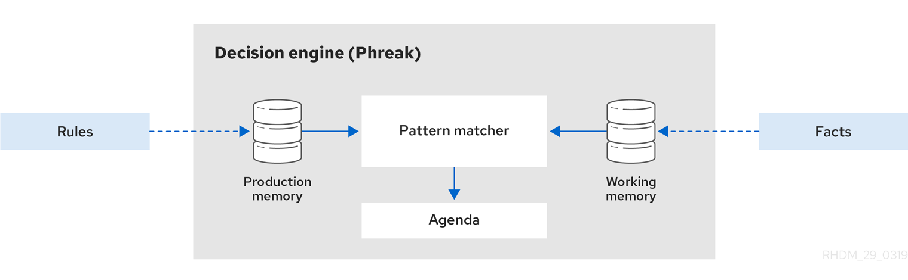

# drools规则引擎

## drools使用的核心优势

- 业务规则与代码解耦,提升可维护性

- 快速响应修改业务规则,无需重启服务

## drools架构模型

**drools 8.44**

## 概念

- DMN(Decision Model and Notation)是[OMG](https://www.omg.org/dmn/)(Object Management Group)建立的一个标准，DMN定义了XML模式，使DMN模型可以在DMN兼容平台中共享运行，以便业务人员和开发人员在设计和实践DMN决策服务时进行协作。

- DRD (Decision Requirements Diagram) 决策需求图 是 DMN 模型的直观表示。 DRD 可以表示 DMN 模型的部分或全部整体决策需求图 (DRG)。 DRD 使用决策节点、业务知识模型、业务知识源、输入数据和决策服务来跟踪业务决策。
